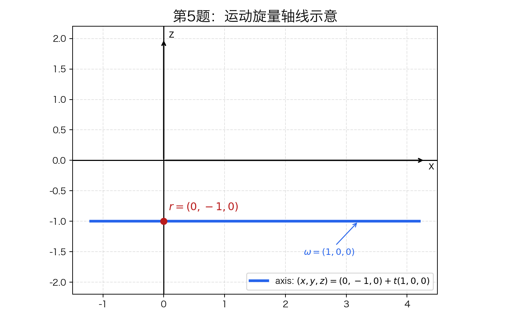
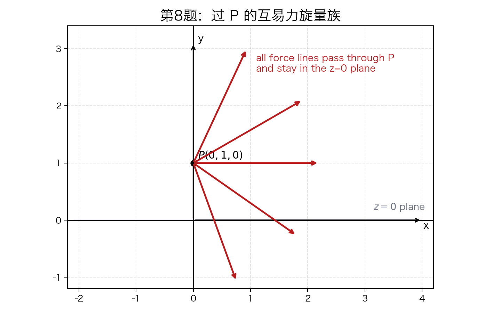

# 第 1 次作业解答

## 说明与假设

1. 第 2 题中的 `(-1,1,2)` 按方向比处理，再单位化。
2. 第 4 题第 (1) 小题的空格可取两个符号，这里取正号。
3. 第 7 题按图示将 `O` 视为单位正方体的一个顶点，三条坐标轴分别沿三条棱方向。
4. 第 13 题按“图中线矢量集合的线性张成维数”理解。
5. 第 5 题和第 8 题需要图示，绘图代码见 [drawings.py](/Users/qianshuang/Project/PythonProject/RobotMechanismHomework/first/source/drawings.py)。

## 运行方法

依赖文件： [requirements.txt](/Users/qianshuang/Project/PythonProject/RobotMechanismHomework/first/source/requirements.txt)

绘图脚本：

```bash
cd ../source
python3 -m venv .venv
source .venv/bin/activate
pip install -r requirements.txt
python drawings.py
```

运行后会在 `../result/` 下生成：

1. `q5_axis.png`
2. `q8_force_family.png`

## 1. 过点 $r_1(1,1,0)$ 与 $r_2(-1,1,2)$ 的直线 Plucker 坐标

方向向量

$$
\mathbf{s}=r_2-r_1=(-2,0,2)\sim(-1,0,1)
$$

矩量

$$
\mathbf{m}=r_1\times \mathbf{s}
=(1,1,0)\times(-1,0,1)=(1,-1,1)
$$

故直线的 Plucker 坐标可写为

$$
L=(-1,0,1;\ 1,-1,1)
$$

单位线矢量为

$$
\hat L=\left(-\frac1{\sqrt2},0,\frac1{\sqrt2};\ \frac1{\sqrt2},-\frac1{\sqrt2},\frac1{\sqrt2}\right)
$$

## 2. 过点 $r_1(1,1,0)$ 且方向比为 $(-1,1,2)$ 的直线 Plucker 坐标

单位方向向量

$$
\mathbf{s}=\frac1{\sqrt6}(-1,1,2)
$$

矩量

$$
\mathbf{m}=r_1\times \mathbf{s}
=\frac1{\sqrt6}(1,1,0)\times(-1,1,2)
=\frac1{\sqrt6}(2,-2,2)
$$

故单位线矢量为

$$
\hat L=\left(-\frac1{\sqrt6},\frac1{\sqrt6},\frac2{\sqrt6};\ \frac2{\sqrt6},-\frac2{\sqrt6},\frac2{\sqrt6}\right)
$$

若不单位化，也可写成

$$
L=(-1,1,2;\ 2,-2,2)
$$

## 3. 填空：使其表示一个线矢量

线矢量条件：

$$
\mathbf{s}\cdot\mathbf{m}=0
$$

1. $(1,0,0;\ \underline{0},0,0)$
2. $(1,1,0;\ 1,\underline{-1},0)$
3. $(1,1,0;\ 0,\underline{0},1)$
4. $(0,\underline{\text{任意}},0;\ 1,0,1)$

## 4. 填空：使之表示一个单位旋量，并确定节距和轴线

单位旋量满足

$$
S=(\mathbf{s};\mathbf{m}),\qquad \|\mathbf{s}\|=1,\qquad h=\mathbf{s}\cdot\mathbf{m}
$$

且

$$
\mathbf{m}=r\times \mathbf{s}+h\mathbf{s}
$$

### (1) $\left(\frac1{\sqrt2},0,\underline{\frac1{\sqrt2}};\ 1,0,1\right)$

$$
\mathbf{s}=\left(\frac1{\sqrt2},0,\frac1{\sqrt2}\right),\qquad \mathbf{m}=(1,0,1)
$$

节距

$$
h=\mathbf{s}\cdot\mathbf{m}=\sqrt2
$$

又因为

$$
\mathbf{m}-h\mathbf{s}=0
$$

故轴线通过原点，方向为

$$
\left(\frac1{\sqrt2},0,\frac1{\sqrt2}\right)
$$

参数式：

$$
(x,y,z)=t\left(\frac1{\sqrt2},0,\frac1{\sqrt2}\right)
$$

### (2) $(0.6,0.8,\underline{0};\ 0,-0.8,1)$

因 $0.6^2+0.8^2=1$，故第三项取 $0$。

$$
\mathbf{s}=(0.6,0.8,0),\qquad \mathbf{m}=(0,-0.8,1)
$$

节距

$$
h=\mathbf{s}\cdot\mathbf{m}=-0.64
$$

计算

$$
\mathbf{n}=\mathbf{m}-h\mathbf{s}=(0.384,-0.288,1)
$$

取轴线上一点

$$
r_0=\mathbf{s}\times \mathbf{n}=(0.8,-0.6,-0.48)
$$

故轴线可写为

$$
(x,y,z)=(0.8,-0.6,-0.48)+t(0.6,0.8,0)
$$

## 5. 已知运动旋量 $V=(1,0,0;\ 0,0,1)$，求 $\omega,r,h$，并绘制轴线位置

有

$$
\omega=(1,0,0)
$$

节距

$$
h=\omega\cdot v=(1,0,0)\cdot(0,0,1)=0
$$

因此这是纯转动旋量。

轴线上点 $r=(x,y,z)$ 满足

$$
r\times \omega=v
$$

即

$$
(x,y,z)\times(1,0,0)=(0,z,-y)=(0,0,1)
$$

解得

$$
z=0,\qquad y=-1
$$

其中 $x$ 任意，故可取

$$
r=(0,-1,0)
$$

轴线为

$$
(x,y,z)=(0,-1,0)+t(1,0,0)
$$

示意图如下：



## 6. 运动旋量与约束旋量互易的物理意义

互易条件

$$
S\circ W=\omega\cdot m+v\cdot f=0
$$

物理意义：约束力旋量对该运动旋量不作功。

1. 若刚体受到纯力约束，则被约束的是沿该力方向的线速度分量。
2. 若刚体受到纯力偶约束，则被约束的是绕该力偶轴方向的角速度分量。

## 7. 单位正方体 12 条边对应的单位线矢量

取立方体顶点为

$$
(0,0,0),(1,0,0),(0,1,0),(0,0,1),(1,1,0),(1,0,1),(0,1,1),(1,1,1)
$$

统一取边方向分别沿 $+x,+y,+z$。

### 平行于 $x$ 轴的 4 条边

$$
\begin{aligned}
L_{x1}&=(1,0,0;\ 0,0,0) \\
L_{x2}&=(1,0,0;\ 0,0,-1) \\
L_{x3}&=(1,0,0;\ 0,1,0) \\
L_{x4}&=(1,0,0;\ 0,1,-1)
\end{aligned}
$$

### 平行于 $y$ 轴的 4 条边

$$
\begin{aligned}
L_{y1}&=(0,1,0;\ 0,0,0) \\
L_{y2}&=(0,1,0;\ 0,0,1) \\
L_{y3}&=(0,1,0;\ -1,0,0) \\
L_{y4}&=(0,1,0;\ -1,0,1)
\end{aligned}
$$

### 平行于 $z$ 轴的 4 条边

$$
\begin{aligned}
L_{z1}&=(0,0,1;\ 0,0,0) \\
L_{z2}&=(0,0,1;\ 0,-1,0) \\
L_{z3}&=(0,0,1;\ 1,0,0) \\
L_{z4}&=(0,0,1;\ 1,-1,0)
\end{aligned}
$$

## 8. 已知运动旋量 $S=(1,0,0;\ 0,0,0)$，求过点 $P(0,1,0)$ 且与之互易的所有力旋量，并图示

设力旋量为

$$
W=(f_x,f_y,f_z;\ m_x,m_y,m_z)
$$

若作用线过点 $P(0,1,0)$，则

$$
\mathbf{m}=P\times \mathbf{f}=(0,1,0)\times(f_x,f_y,f_z)=(f_z,0,-f_x)
$$

互易条件

$$
S\circ W=(1,0,0)\cdot(m_x,m_y,m_z)=m_x=0
$$

故

$$
f_z=0
$$

所以所有满足条件的力旋量为

$$
W=(f_x,f_y,0;\ 0,0,-f_x),\qquad (f_x,f_y)\neq(0,0)
$$

几何意义：所有作用线经过点 $P(0,1,0)$ 且位于平面 $z=0$ 内的纯力。

示意图如下：



## 9. 求与给定 3 关节串联操作手互易的旋量系

已知

$$
\left\{
\begin{aligned}
S_1&=(0,0,1;\ 0,0,0)\\
S_2&=(L_2,M_2,0;\ P_2,Q_2,0)\\
S_3&=(L_3,M_3,0;\ P_3,Q_3,0)
\end{aligned}
\right.
$$

设互易力旋量为

$$
W=(f_x,f_y,f_z;\ m_x,m_y,m_z)
$$

则互易条件为

$$
\left\{
\begin{aligned}
&m_z=0\\
&L_2m_x+M_2m_y+P_2f_x+Q_2f_y=0\\
&L_3m_x+M_3m_y+P_3f_x+Q_3f_y=0
\end{aligned}
\right.
$$

故互易旋量系为

$$
W=\left\{(f_x,f_y,f_z;\ m_x,m_y,0)\ \middle|\
\begin{array}{l}
L_2m_x+M_2m_y+P_2f_x+Q_2f_y=0\\
L_3m_x+M_3m_y+P_3f_x+Q_3f_y=0
\end{array}
\right\}
$$

这是一个 3 维力旋量系。

## 10. 求与给定 3R 串联操作手互易的旋量系

设互易力旋量

$$
W=(f_x,f_y,f_z;\ m_x,m_y,m_z)
$$

由 $S_i\circ W=0$ 得

$$
\left\{
\begin{aligned}
&m_z=0\\
&c\theta_1\,m_x+s\theta_1\,m_y-z_0s\theta_1\,f_x+z_0c\theta_1\,f_y=0\\
&(-s\theta_1c\theta_2)m_x+(c\theta_1c\theta_2)m_y\\
&\qquad +(-z_0c\theta_1c\theta_2+ls\theta_1s\theta_2)f_x\\
&\qquad +(-z_0s\theta_1c\theta_2-lc\theta_1s\theta_2)f_y\\
&\qquad +lc\theta_2\,f_z=0
\end{aligned}
\right.
$$

因此互易旋量系写为

$$
W=\left\{(f_x,f_y,f_z;\ m_x,m_y,0)\ \middle|\
\begin{array}{l}
c\theta_1\,m_x+s\theta_1\,m_y-z_0s\theta_1\,f_x+z_0c\theta_1\,f_y=0\\
(-s\theta_1c\theta_2)m_x+(c\theta_1c\theta_2)m_y\\
\quad +(-z_0c\theta_1c\theta_2+ls\theta_1s\theta_2)f_x\\
\quad +(-z_0s\theta_1c\theta_2-lc\theta_1s\theta_2)f_y+\ lc\theta_2\,f_z=0
\end{array}
\right\}
$$

它也是一个 3 维力旋量系。

## 11. 判断给定二阶旋量系是否为自互易旋量系

$$
\left\{
\begin{aligned}
S_1&=(1,0,0;\ 0,0,1)\\
S_2&=(0,1,0;\ 1,0,0)
\end{aligned}
\right.
$$

计算互易积

$$
S_1\circ S_2=(1,0,0)\cdot(1,0,0)+(0,0,1)\cdot(0,1,0)=1\neq 0
$$

故该二阶旋量系不是自互易旋量系。

## 12. 判断给定三阶旋量系是否为自互易旋量系

$$
\left\{
\begin{aligned}
S_1&=(1,0,0;\ 0,0,0)\\
S_2&=(0,1,0;\ 0,0,0)\\
S_3&=(0,0,1;\ 0,0,0)
\end{aligned}
\right.
$$

任意两者互易积都为 0，故该三阶旋量系是自互易旋量系。

## 13. 确定各旋量空间的维数

| 图号 | 类型 | 维数 |
|---|---|---:|
| (a) | 共轴 | 2 |
| (b) | 共面平行 | 2 |
| (c) | 平面汇交 | 2 |
| (d) | 空间平行 | 3 |
| (e) | 共面 | 3 |
| (f) | 空间共点 | 3 |
| (g) | 两组共点共面线簇的并集 | 3 |
| (h) | 平行同一平面 | 5 |
