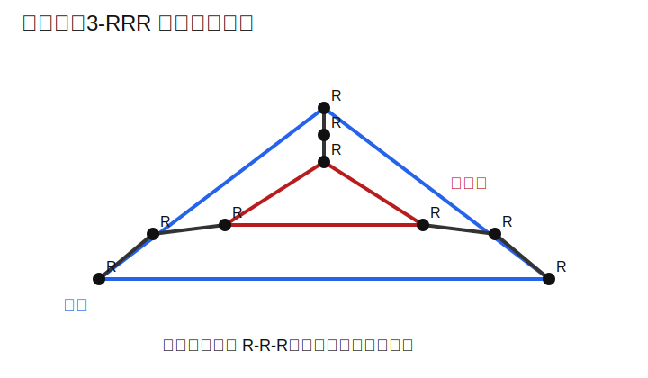
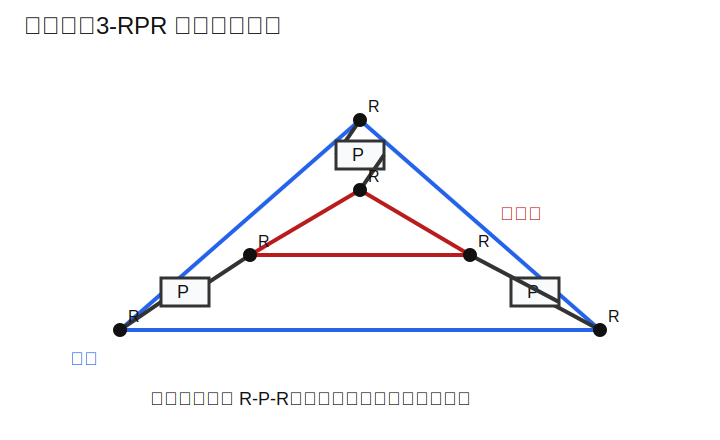

# 第 3 次作业解答

## 说明

1. 第 1 题要求画机构简图，因此给出 Python 绘图代码 [drawings.py](./drawings.py)。
2. 已运行绘图脚本并生成示意图，结果插入在本文中。
3. 简图强调机构拓扑关系与自由度含义，不追求工程装配细节。

## 1. 基于转动副与移动副，综合两个三支链、具有平面 3 自由度运动的并联机构

平面 3 自由度运动即

$$
2T1R
$$

也就是动平台在同一平面内具有两个平移自由度和一个绕平面法向的转动自由度。

### 方案一：3-RRR 平面并联机构

每条支链都由三个转动副组成：

$$
R-R-R
$$

机构特点：

1. 三条支链均位于同一平面内。
2. 第一转动副连接机架，第三转动副连接动平台。
3. 动平台由三条支链共同支承，能够实现平面内的两平移一转动。

简图如下：

该机构满足题目要求，因为它的动平台输出为标准平面 `2T1R` 运动。

### 方案二：3-RPR 平面并联机构

每条支链采用

$$
R-P-R
$$

机构特点：

1. 中间移动副位于工作平面内。
2. 三条支链分别连接机架与动平台的三个点。
3. 通过三条平面支链的组合，平台获得两个平移和一个转动自由度。

简图如下：

因此，第 1 题可以给出以下两个满足条件的三支链并联机构：

1. `3-RRR` 平面并联机构。
2. `3-RPR` 平面并联机构。

## 2. 基于约束旋量理论综合可实现 3R1T 运动的并联机构思路

题目要求的是综合思路，不要求枚举所有机构，故按约束旋量理论给出如下过程。

### 第一步：确定目标运动旋量系

若希望机构实现

$$
3R1T
$$

运动，则动平台应保留 4 个独立运动自由度。可取一个典型目标为：

$$
\{R_x,\ R_y,\ R_z,\ T_z\}
$$

即允许绕三个坐标轴转动，并允许沿 $z$ 方向平移。

### 第二步：由运动旋量系求总约束旋量系

空间刚体总自由度为 6，因此所需总约束维数为

$$
6-4=2
$$

这说明整个并联机构应当总共提供 2 个线性无关的约束旋量。

若保留全部 3 个转动，只去掉两个平移，则最直接的方式是令总约束为两个纯力旋量，例如

$$
W_1=F_x,\qquad W_2=F_y
$$

这样它们约束了沿 $x$、$y$ 方向的平移，而不约束绕各轴转动及沿 $z$ 方向的平移，因此保留的运动正好是

$$
3R1T
$$

### 第三步：将总约束分配到各支链

三条支链的约束旋量叠加后，整体秩应为 2。设计时可采用以下原则：

1. 至少两条支链分别提供两个线性无关的纯力约束。
2. 第三条支链提供与前两者线性相关的约束，或主要承担驱动与支撑作用。
3. 任何支链都不能额外引入破坏 `3R1T` 的多余独立约束。

### 第四步：由支链约束反求支链结构类型

根据“支链运动旋量系与支链约束旋量系互易”的原则，选取由转动副、移动副、万向副、圆柱副、球副构成的支链。

可采用的思路是：

1. 若希望某支链提供一条明确的纯力约束，可优先考虑杆式支链，例如含 `S` 或 `U` 副的支链。
2. 若希望保留较多姿态适应能力，应尽量避免单条支链自身形成过强定向约束。
3. 三条支链在空间的布置应使两条总约束力方向线性无关，并与目标平移方向相匹配。

### 第五步：验证综合结果

综合完成后，应检查：

1. 总约束秩是否确为 2。
2. 动平台实际保留的自由度是否恰为 `3R1T`。
3. 是否存在多余约束。
4. 是否存在奇异位形或寄生运动。

### 结论

基于约束旋量理论综合 `3R1T` 并联机构的核心步骤是：

1. 先定目标运动旋量系。
2. 再求其互易的总约束旋量系。
3. 再把总约束合理分配到三条支链。
4. 最后由互易关系反推出满足要求的支链结构。
